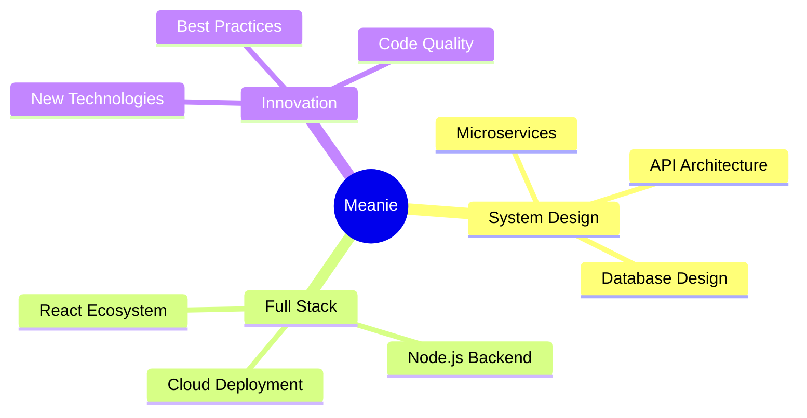

# 💫 Meanie

<div align="center">
  
</div>

<div align="center">
  
  
</div>

---

## ✨ About Me


```typescript
const meanie = {
    education: "B.Eng. Computer Engineering @ SUT",
    currentRole: "Software Developer @ Compattana Co.,Ltd",
    passions: [
        "System Analysis & Design",
        "Software Engineering", 
        "Full Stack Development"
    ],
    motto: "Building digital solutions, one line at a time ⚡"
};
```

<br clear="both"/>

## 🛠️ Tech Arsenal

<details>
<summary><b>🌐 Languages & Core</b></summary>
<br>

```yaml
Primary:
  - TypeScript  # Modern JS with types
  - JavaScript  # The web foundation
  - Go         # Backend powerhouse
  - Python     # Data & automation
```

<p>
  
</p>
</details>

<details>
<summary><b>⚛️ Frontend Ecosystem</b></summary>
<br>

```yaml
Frameworks:
  - Next.js     # React production framework
  - React       # Component-based UI
  - Angular     # Enterprise applications
  - Vite        # Lightning-fast bundler

UI Libraries:
  - Ant Design  # Professional components
  - Material-UI # Google's design system
  - Chart.js    # Data visualization
```

<p>
  
</p>
</details>

<details>
<summary><b>⚙️ Backend & Infrastructure</b></summary>
<br>

```yaml
Runtime:
  - Node.js     # JavaScript everywhere
  - Express.js  # Minimalist web framework

Databases:
  - MySQL       # Relational database
  - MariaDB     # MySQL enhanced
  - SQLite      # Embedded database
  - MongoDB     # Document database
  - Firebase    # Google's BaaS

DevOps:
  - Docker      # Containerization
  - Nginx       # Web server
  - GitHub Actions # CI/CD pipeline
```

<p>
  
</p>
</details>

<details>
<summary><b>🎯 Development Tools</b></summary>
<br>

```yaml
Editor:
  - VS Code     # Primary IDE

Testing & API:
  - Postman     # API development

Cloud & Deployment:
  - DigitalOcean # Cloud infrastructure
  - GoDaddy     # Domain management

Hardware:
  - Arduino     # IoT projects
```

<p>
  
</p>
</details>

---

## 📊 GitHub Analytics

<div align="center">
  
  
</div>

<div align="center">
  
</div>

---

## 🎯 Current Focus



---

## 🌊 Activity Graph

<div align="center">
  
</div>

---

<div align="center">
  
</div>

<div align="center">
  <a href="mailto:siriphob.poonprasit@compattana.com">
    
  </a>
  <a href="https://github.com/siriphobpps46">
    
  </a>
</div>

---

<div align="center">
  
</div>
